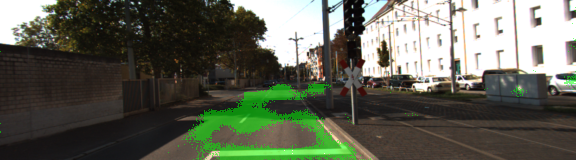

# KITTI Road Sementic Segmentation<a id="sec-1"></a>

The problem is to segment driving roads from others

## Table of Contents

- [Dataset](#sec-1-1)
- [Results](#sec-1-2)
- [Method](#sec-1-3)
  - [VGG16](#sec-1-3-1)
  - [Skip Connection](#sec-1-3-2)
  - [Fully Convolution Network](#sec-1-3-3)
- [Hyperparameters and notes](#sec-1-4)
  - [Xavier Initialization](#sec-1-4-1)
  - [L2 Regularizer](#sec-1-4-2)
  - [AdamOptimizer](#sec-1-4-3)
  - [Saver and Builder](#sec-1-4-4)

## Dataset<a id="sec-1-1"></a>

-   [KITTI Road/Lane Detection Dataset](http://www.cvlibs.net/datasets/kitti/eval_road.php)

Sample input and ground truth images

<div>


</div>

## Results<a id="sec-1-2"></a>

<div>




</div>

## Method<a id="sec-1-3"></a>

-   Pretrained VGG16
-   Skip Connection
-   Fully Convolution Network

### VGG16<a id="sec-1-3-1"></a>

First, I used the pre-trained VGG16 network

```python
tf.saved_model.loader.load(sess, [vgg_tag], vgg_path)
```

### Skip Connection<a id="sec-1-3-2"></a>

Skip connection greatly improves the performance of network.

First, run 1x1 convolution and then followed by `conv_transpose` layer

```python
# layer7 -> Conv 1x1 -> ConvT
with tf.variable_scope("layer7_deconv"):
    conv_1x1 = run_conv_1x1(vgg_layer7_out)
    output = run_conv_transpose(conv_1x1, 4, 2)

# layer4 -> Conv 1x1 -> ConvT
with tf.variable_scope("layer4_deconv"):
    conv_1x1 = run_conv_1x1(vgg_layer4_out)
    merged = tf.add(output, conv_1x1)
    output = run_conv_transpose(merged, 4, 2)

# layer3 -> Conv 1x1 -> ConvT
with tf.variable_scope("layer3_deconv"):
    conv_1x1 = run_conv_1x1(vgg_layer3_out)
    merged = tf.add(output, conv_1x1)
    output = run_conv_transpose(merged, 16, 8, name="nn_last_layer")

return output
```

### Fully Convolution Network<a id="sec-1-3-3"></a>

After all, we will need a fully convolution network because the label is the same size as the input image.

In this example, only 2 labels(road or not road) exist. Therefore, output shape is `(?, 160, 576, 2)`.

## Hyperparameters and notes<a id="sec-1-4"></a>

### Xavier Initialization<a id="sec-1-4-1"></a>

I tried xavier, he, random initializers, but xavier works the best in this example based on random search.

For the code, I used `tf.contrib.layers.variance_scaling_initializer` because it's the most versatile.

```python
initializers = {"factor": 1.0, "mode": 'FAN_AVG', "uniform": True}

def run_conv_1x1(input_):
    """Returns 1x1 Convolution"""
    return tf.layers.conv2d(
        input_,
        num_classes,
        kernel_size=1,
        padding="same",
        kernel_initializer=tf.contrib.layers.variance_scaling_initializer(
            **initializers),
        kernel_regularizer=tf.contrib.layers.l2_regularizer(reg))
```

### L2 Regularizer<a id="sec-1-4-2"></a>

I usually tend to add a tiny bit of regularization terms to the kernel. So I added

```python
reg = 1e-3
kernel_regularizer=tf.contrib.layers.l2_regularizer(reg)
```

### AdamOptimizer<a id="sec-1-4-3"></a>

Learning rate won't matter much because of the characteristics of `AdamOptimizer`. However, the default setting for Adam optimizer is not really great (it's even written on the [official documentation](https://www.tensorflow.org/versions/r1.0/api_docs/python/tf/train/AdamOptimizer#__init__).)

Note that the epsilon is 1.0 (it's important!)

```python
optim = tf.train.AdamOptimizer(learning_rate, epsilon=1.0)
train_op = optim.minimize(xentroy_loss, global_step=global_step)
```

### Saver and Builder<a id="sec-1-4-4"></a>

`tf.Saver` is the old way of saving models in Tensorflow. And [SavedModel API](https://www.tensorflow.org/programmers_guide/saved_model#overview_of_saving_and_restoring_models) is the new way of saving models. It is great but it's still a wrapper around `tf.Saver`. I can see why it's beneficial, but it tends to create more unnecessary files.

1.  Saver

    ```python
    saver = tf.train.Saver()

    # when loading from checkpoint
    last_checkpoint = tf.train.latest_checkpoint(FLAGS.checkpoint)

    if saver and last_checkpoint:
        saver.restore(sess, last_checkpoint)
    else:
        # if no checkpoint initialize
        sess.run(tf.global_variables_initializer())

    # when save
    saver.save(sess, os.path.join(FLAGS.checkpoint, "model.ckpt"))
    ```

2.  Builder

    When using `Builder`, you should be careful if the directory already exists, it will result in an error.

    ```python
    builder = tf.saved_model.builder.SavedModelBuilder("builder")

    with tf.Session(graph=tf.Graph()) as sess:
        builder.add_meta_graph_and_variables(sess, ["VGG16_SEMENTIC"])
        builder.save()

    ```

    When loading from builder, it's nice and clean.

    ```python
    tags = ["VGG16_SEMENTIC"]
    tf.saved_model.loader.load(sess, tags, builder_path)
    ```
